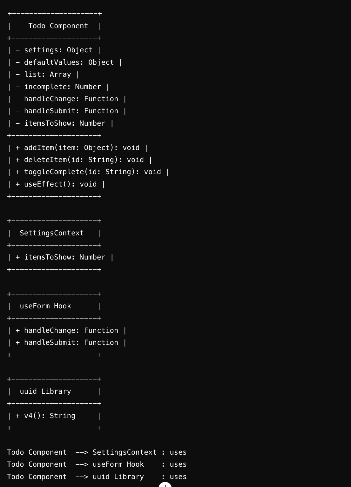

## todo-app-auth

 **author**: Agabekian
 / lab33/ 6.12.24
* Admin: full access including  `DELETE` button.
* Writer can create tasks.
* Editor can update and create(?)
* User sees nothing 'cuz tasks not stored yet
#### setup:
`npm install uuid mantine react-if react-cookies jwt-decode`
####  test setup 
`npm install vitest jsdom @testing-library/react @testing-library/jest-dom --save-dev`

#### run 
`npm run dev`
#### UML
###### Notes:
6.13.24 `Local Storage` added.

(Thanks Brandon, indeed it was needed if using the react-router)
